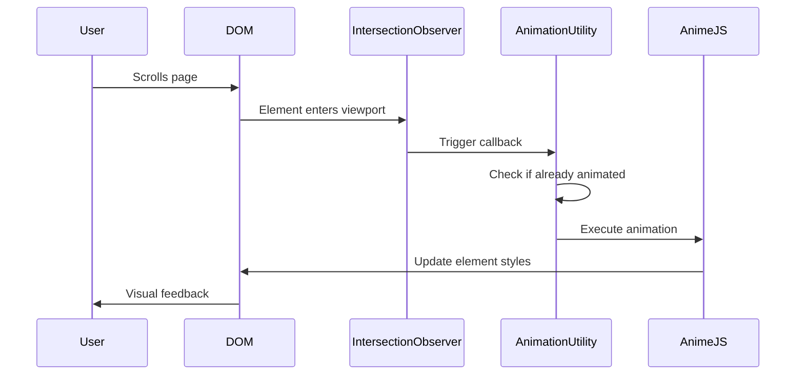

# Design Document: GSAP to Anime.js Migration

## Overview

This design document outlines the technical approach for migrating the SafeDrive web application from GSAP (GreenSock Animation Platform) to Anime.js. The migration maintains identical visual behavior while reducing bundle size and external dependencies.

The migration involves three main components:
1. **Core Animation Replacement**: Converting GSAP tweens and timelines to Anime.js equivalents
2. **ScrollTrigger Replacement**: Implementing scroll-based animation triggers using native IntersectionObserver API
3. **Utility Layer**: Creating reusable helper functions for common animation patterns

### Current GSAP Usage Analysis

Based on codebase audit, GSAP is used in the following locations:

**Files with GSAP:**
- `index.html` - Hero animation, announcement banner, quote animations, QR color cycling
- `script.js` - Hero animation sequence, leaderboard ScrollTrigger, subscribe button hover
- `plate.html` - Subscribe button hover animation

**Animation Types:**
1. **Timeline Animations**: Complex sequences with multiple steps (hero animation)
2. **Hover Animations**: Interactive button scale effects (subscribe buttons)
3. **Scroll-Triggered Animations**: Viewport-based triggers (leaderboard stagger)
4. **Infinite Loop Animations**: Continuous effects (QR puzzle, announcement banner)
5. **Stagger Animations**: Sequential element animations (leaderboard rows, QR tiles)

## Architecture

### High-Level Architecture

```
┌─────────────────────────────────────────────────────────┐
│                    SafeDrive Application                 │
├─────────────────────────────────────────────────────────┤
│                                                           │
│  ┌──────────────────────────────────────────────────┐  │
│  │         Animation Utility Layer (New)             │  │
│  │  - scrollTriggerAnimation()                       │  │
│  │  - createTimeline()                               │  │
│  │  - animateOnce()                                  │  │
│  └──────────────────────────────────────────────────┘  │
│                          │                               │
│                          ▼                               │
│  ┌──────────────────────────────────────────────────┐  │
│  │              Anime.js Library                     │  │
│  │  - anime()                                        │  │
│  │  - anime.timeline()                               │  │
│  └──────────────────────────────────────────────────┘  │
│                          │                               │
│                          ▼                               │
│  ┌──────────────────────────────────────────────────┐  │
│  │         Native Browser APIs                       │  │
│  │  - IntersectionObserver                           │  │
│  │  - requestAnimationFrame                          │  │
│  └──────────────────────────────────────────────────┘  │
│                                                           │
└─────────────────────────────────────────────────────────┘
```

### Component Interaction Flow



## Components and Interfaces

### 1. Anime.js Integration

**Purpose**: Replace GSAP as the core animation engine

**Implementation**:
- Add Anime.js via CDN: `https://cdn.jsdelivr.net/npm/animejs@3.2.1/lib/anime.min.js`
- Remove GSAP and ScrollTrigger CDN links
- Update all animation calls to use Anime.js API

**API Mapping**:

| GSAP | Anime.js | Notes |
|------|----------|-------|
| `gsap.to(target, {})` | `anime({ targets: target, ... })` | Basic tween |
| `gsap.set(target, {})` | Direct style manipulation or `anime.set()` | Initial state |
| `gsap.timeline()` | `anime.timeline()` | Sequential animations |
| `duration: 0.8` | `duration: 800` | GSAP uses seconds, Anime.js uses milliseconds |
| `ease: "power3.out"` | `easing: 'easeOutCubic'` | Easing function mapping |
| `ease: "power2.out"` | `easing: 'easeOutQuad'` | Easing function mapping |
| `ease: "back.out(1.5)"` | `easing: 'easeOutBack'` | Back easing |
| `stagger: 0.08` | `delay: anime.stagger(80)` | Stagger in milliseconds |
| `repeat: -1` | `loop: true` | Infinite repeat |
| `yoyo: true` | `direction: 'alternate'` | Bounce back |

### 2. ScrollTrigger Replacement

**Purpose**: Trigger animations when elements enter viewport without GSAP plugin

**Implementation Strategy**:

```javascript
// Utility function for scroll-triggered animations
function scrollTriggerAnimation(selector, animationConfig, options = {}) {
    const elements = document.querySelectorAll(selector);
    const {
        threshold = 0.2,  // Equivalent to 'start: top 80%'
        once = true,
        rootMargin = '0px'
    } = options;

    const observer = new IntersectionObserver((entries) => {
        entries.forEach(entry => {
            if (entry.isIntersecting) {
                // Trigger animation
                anime({
                    targets: entry.target,
                    ...animationConfig
                });

                // Disconnect if once is true
                if (once) {
                    observer.unobserve(entry.target);
                }
            }
        });
    }, { threshold, rootMargin });

    elements.forEach(el => observer.observe(el));
    
    return observer;
}
```

**IntersectionObserver Configuration**:
- `threshold: 0.2` maps to ScrollTrigger's `start: 'top 80%'`
- `once: true` prevents re-triggering on scroll up
- `rootMargin` can adjust trigger point if needed

### 3. Animation Utility Functions

**Purpose**: Provide reusable animation patterns

**Functions**:

#### 3.1 `createTimeline()`
```javascript
function createTimeline(animations) {
    const tl = anime.timeline({
        easing: 'easeOutExpo',
        duration: 750
    });
    
    animations.forEach(anim => {
        tl.add(anim.config, anim.offset || '+=0');
    });
    
    return tl;
}
```

#### 3.2 `animateOnce()`
```javascript
const animatedElements = new WeakSet();

function animateOnce(element, config) {
    if (animatedElements.has(element)) return;
    
    animatedElements.add(element);
    anime({
        targets: element,
        ...config
    });
}
```

#### 3.3 `hoverAnimation()`
```javascript
function hoverAnimation(element, hoverConfig, leaveConfig) {
    element.addEventListener('mouseenter', () => {
        anime({
            targets: element,
            ...hoverConfig
        });
    });
    
    element.addEventListener('mouseleave', () => {
        anime({
            targets: element,
            ...leaveConfig
        });
    });
}
```

## Data Models

### Animation Configuration Object

```typescript
interface AnimeConfig {
    targets: string | Element | Element[];
    duration?: number;          // milliseconds
    delay?: number | Function;  // milliseconds or stagger function
    easing?: string;
    loop?: boolean;
    direction?: 'normal' | 'reverse' | 'alternate';
    autoplay?: boolean;
    
    // Transform properties
    translateX?: number | string;
    translateY?: number | string;
    scale?: number;
    rotate?: number | string;
    
    // Style properties
    opacity?: number;
    backgroundColor?: string;
    color?: string;
    
    // SVG properties
    fill?: string;
    
    // Custom properties
    [key: string]: any;
}

interface TimelineAnimation {
    config: AnimeConfig;
    offset?: string | number;  // Timeline offset (e.g., '-=400', '+=200')
}

interface ScrollTriggerOptions {
    threshold?: number;         // 0-1, viewport intersection ratio
    once?: boolean;            // Animate only once
    rootMargin?: string;       // Adjust trigger point
}
```

### Animation State Tracking

```typescript
interface AnimationState {
    element: Element;
    hasAnimated: boolean;
    observer?: IntersectionObserver;
    animation?: anime.AnimeInstance;
}
```

## 
Correctness Properties

*A property is a characteristic or behavior that should hold true across all valid executions of a system-essentially, a formal statement about what the system should do. Properties serve as the bridge between human-readable specifications and machine-verifiable correctness guarantees.*

### Property 1: Timeline duration preservation
*For any* converted timeline animation, the total duration of the Anime.js implementation should equal the total duration of the original GSAP timeline
**Validates: Requirements 2.1**

### Property 2: Property mapping correctness
*For any* animation with transform properties (scale, opacity, filter, letterSpacing, etc.), the Anime.js implementation should apply the same property transformations as the GSAP version
**Validates: Requirements 2.2**

### Property 3: Timeline offset preservation
*For any* timeline animation with relative timing offsets (e.g., '-=0.4'), the Anime.js timeline should maintain the same temporal relationships between animation steps
**Validates: Requirements 2.3**

### Property 4: Easing function equivalence
*For any* animation using an easing function, the Anime.js easing curve should produce visually equivalent motion to the GSAP easing function
**Validates: Requirements 2.5, 3.3**

### Property 5: Hover animation interruption handling
*For any* sequence of rapid hover events on an element, the animation system should gracefully handle interruptions without visual glitches or errors
**Validates: Requirements 3.4**

### Property 6: IntersectionObserver setup
*For any* element with scroll-triggered animation, an IntersectionObserver should be created and properly observe that element
**Validates: Requirements 4.1**

### Property 7: Scroll threshold accuracy
*For any* scroll-triggered animation with a specified threshold, the IntersectionObserver threshold should correctly map from the GSAP ScrollTrigger configuration
**Validates: Requirements 4.3**

### Property 8: Once-only animation behavior
*For any* scroll-triggered animation with once: true, the animation should play exactly one time even if the element re-enters the viewport multiple times
**Validates: Requirements 4.4**

### Property 9: Observer-animation connection
*For any* element observed by IntersectionObserver, when the element enters the viewport, the corresponding Anime.js animation should be initiated
**Validates: Requirements 4.5**

### Property 10: Stagger property values
*For any* stagger animation, the opacity and translateY properties should animate from their initial values (0, 20) to their final values (1, 0)
**Validates: Requirements 5.2**

### Property 11: Stagger duration consistency
*For any* stagger animation, each element should animate with the specified duration (e.g., 500ms for leaderboard)
**Validates: Requirements 5.3**

### Property 12: Stagger easing application
*For any* stagger animation with easing, the correct Anime.js easing function should be applied to match the original GSAP easing
**Validates: Requirements 5.4**

### Property 13: Color transition timing
*For any* color cycling animation, the fill color transitions should occur with the specified duration (e.g., 400ms for QR)
**Validates: Requirements 6.2**

### Property 14: Infinite loop behavior
*For any* animation configured with infinite repeat, the Anime.js implementation should loop continuously without stopping
**Validates: Requirements 6.3**

### Property 15: Utility function interface
*For any* scroll-triggered animation created via utility function, the function should accept a selector and animation configuration object
**Validates: Requirements 8.1**

### Property 16: Utility observer creation
*For any* call to the scroll trigger utility function, an IntersectionObserver should be created and the animation should trigger on viewport entry
**Validates: Requirements 8.2**

### Property 17: Counter utility functionality
*For any* number counter animation, the counter utility should animate from start value to end value using Anime.js
**Validates: Requirements 8.3**

### Property 18: Animation state tracking
*For any* element animated with once: true, the system should track that the element has been animated and prevent re-animation
**Validates: Requirements 8.4**

### Property 19: Scroll trigger position preservation
*For any* scroll-triggered animation, the viewport entry threshold should match the original GSAP ScrollTrigger configuration
**Validates: Requirements 9.2**

### Property 20: Animation performance
*For any* animation sequence, the frame rate should maintain 60fps or better during animation playback
**Validates: Requirements 9.5**

## Error Handling

### Animation Initialization Errors

**Scenario**: Anime.js library fails to load or is not available

**Handling**:
```javascript
function safeAnimate(config) {
    if (typeof anime === 'undefined') {
        console.error('Anime.js library not loaded');
        return null;
    }
    
    try {
        return anime(config);
    } catch (error) {
        console.error('Animation error:', error);
        return null;
    }
}
```

### IntersectionObserver Compatibility

**Scenario**: Browser doesn't support IntersectionObserver (older browsers)

**Handling**:
```javascript
function scrollTriggerAnimation(selector, animationConfig, options = {}) {
    if (!('IntersectionObserver' in window)) {
        console.warn('IntersectionObserver not supported, running animation immediately');
        anime({
            targets: selector,
            ...animationConfig
        });
        return null;
    }
    
    // Normal IntersectionObserver setup
    // ...
}
```

### Element Not Found

**Scenario**: Animation target selector doesn't match any elements

**Handling**:
```javascript
function animateElement(selector, config) {
    const elements = document.querySelectorAll(selector);
    
    if (elements.length === 0) {
        console.warn(`No elements found for selector: ${selector}`);
        return null;
    }
    
    return anime({
        targets: elements,
        ...config
    });
}
```

### Animation Interruption

**Scenario**: New animation starts before previous animation completes

**Handling**:
- Anime.js automatically handles this by default
- Previous animation is stopped and new animation takes over
- No additional error handling needed for basic cases
- For complex cases, store animation instances and manually control:

```javascript
let currentAnimation = null;

function interruptibleAnimate(config) {
    if (currentAnimation) {
        currentAnimation.pause();
    }
    
    currentAnimation = anime(config);
    return currentAnimation;
}
```

### Invalid Configuration

**Scenario**: Animation configuration contains invalid properties or values

**Handling**:
```javascript
function validateAnimationConfig(config) {
    const required = ['targets'];
    const missing = required.filter(key => !(key in config));
    
    if (missing.length > 0) {
        throw new Error(`Missing required animation properties: ${missing.join(', ')}`);
    }
    
    if (config.duration && config.duration < 0) {
        console.warn('Negative duration detected, using absolute value');
        config.duration = Math.abs(config.duration);
    }
    
    return config;
}
```

## Testing Strategy

### Unit Testing

Unit tests will verify specific animation configurations and utility functions:

**Test Cases**:
1. **Utility Function Tests**
   - `scrollTriggerAnimation()` creates IntersectionObserver
   - `hoverAnimation()` attaches correct event listeners
   - `animateOnce()` prevents duplicate animations
   - State tracking with WeakSet works correctly

2. **Configuration Mapping Tests**
   - GSAP duration (seconds) converts to Anime.js duration (milliseconds)
   - Easing function names map correctly
   - Stagger values convert properly
   - Timeline offsets translate accurately

3. **Error Handling Tests**
   - Missing Anime.js library handled gracefully
   - Invalid selectors don't crash
   - Missing IntersectionObserver support falls back correctly

### Property-Based Testing

Property-based tests will verify universal behaviors across many inputs:

**Test Framework**: Use `fast-check` for JavaScript property-based testing

**Property Tests**:

1. **Duration Conversion Property**
   - Generate random GSAP durations (0.1 to 10 seconds)
   - Convert to Anime.js milliseconds
   - Verify: `animejsDuration === gsapDuration * 1000`

2. **Easing Mapping Property**
   - Generate all GSAP easing function names
   - Map to Anime.js equivalents
   - Verify: mapping exists for each GSAP easing

3. **Stagger Calculation Property**
   - Generate random stagger values (0.01 to 1 second)
   - Convert to Anime.js stagger
   - Verify: `anime.stagger(value * 1000)` produces correct delays

4. **Timeline Offset Property**
   - Generate random timeline offsets ('-=0.5', '+=0.3', etc.)
   - Verify: Anime.js timeline maintains temporal relationships

5. **Once Animation Property**
   - Generate random elements
   - Trigger animation with once: true
   - Simulate multiple viewport entries
   - Verify: animation plays exactly once

6. **Threshold Mapping Property**
   - Generate ScrollTrigger start positions ('top 80%', 'top 50%', etc.)
   - Convert to IntersectionObserver threshold
   - Verify: threshold value is between 0 and 1

### Integration Testing

Integration tests will verify complete animation sequences:

**Test Scenarios**:
1. **Hero Animation Sequence**
   - Load page with hero animation
   - Verify all animation steps execute in order
   - Verify timing matches original GSAP version
   - Measure total animation duration

2. **Scroll-Triggered Leaderboard**
   - Scroll to leaderboard section
   - Verify IntersectionObserver triggers
   - Verify stagger animation plays
   - Verify animation plays only once

3. **Hover Interactions**
   - Simulate mouseenter on subscribe button
   - Verify scale animation to 1.1
   - Simulate mouseleave
   - Verify scale animation back to 1.0
   - Simulate rapid hover events
   - Verify no errors or visual glitches

4. **QR Animation Loop**
   - Start QR animation in index.html
   - Verify infinite loop behavior
   - Verify color cycling continues
   - Verify sliding puzzle movements

### Visual Regression Testing

Visual regression tests will compare animation frames:

**Approach**:
1. Record GSAP animation frames at key timestamps
2. Record Anime.js animation frames at same timestamps
3. Compare frames using image diff tools
4. Verify visual differences are below threshold (< 1% pixel difference)

**Tools**:
- Playwright for browser automation
- Pixelmatch for image comparison
- Record at 60fps for smooth comparison

### Performance Testing

Performance tests will measure animation efficiency:

**Metrics**:
1. **Frame Rate**: Measure FPS during animation playback
   - Target: 60fps minimum
   - Tool: `requestAnimationFrame` timing

2. **Memory Usage**: Monitor memory during animations
   - Verify no memory leaks
   - Tool: Chrome DevTools Performance profiler

3. **Bundle Size**: Compare library sizes
   - GSAP + ScrollTrigger: ~50KB minified
   - Anime.js: ~17KB minified
   - Expected reduction: ~33KB (~66% smaller)

4. **Animation Start Time**: Measure time from trigger to first frame
   - Target: < 16ms (one frame at 60fps)
   - Compare GSAP vs Anime.js

### Cross-Browser Testing

Verify animations work across browsers:

**Browsers**:
- Chrome (latest)
- Firefox (latest)
- Safari (latest)
- Edge (latest)

**Test Matrix**:
- All animation types (timeline, hover, scroll-triggered, infinite)
- IntersectionObserver support
- Anime.js compatibility
- Visual consistency

## Implementation Notes

### Migration Order

1. **Phase 1: Setup**
   - Add Anime.js library
   - Create utility functions
   - Keep GSAP alongside for comparison

2. **Phase 2: Simple Animations**
   - Migrate hover animations (subscribe buttons)
   - Migrate simple tweens
   - Test and verify

3. **Phase 3: Timeline Animations**
   - Migrate hero animation sequence
   - Migrate QR animations
   - Test and verify

4. **Phase 4: Scroll-Triggered Animations**
   - Implement IntersectionObserver utilities
   - Migrate leaderboard stagger
   - Migrate announcement banner
   - Test and verify

5. **Phase 5: Cleanup**
   - Remove GSAP and ScrollTrigger
   - Final testing
   - Performance validation

### Easing Function Reference

Complete mapping of GSAP to Anime.js easing:

| GSAP | Anime.js |
|------|----------|
| `power1.in` | `easeInQuad` |
| `power1.out` | `easeOutQuad` |
| `power1.inOut` | `easeInOutQuad` |
| `power2.in` | `easeInQuad` |
| `power2.out` | `easeOutQuad` |
| `power2.inOut` | `easeInOutQuad` |
| `power3.in` | `easeInCubic` |
| `power3.out` | `easeOutCubic` |
| `power3.inOut` | `easeInOutCubic` |
| `power4.in` | `easeInQuart` |
| `power4.out` | `easeOutQuart` |
| `power4.inOut` | `easeInOutQuart` |
| `back.in` | `easeInBack` |
| `back.out` | `easeOutBack` |
| `back.inOut` | `easeInOutBack` |
| `elastic.in` | `easeInElastic` |
| `elastic.out` | `easeOutElastic` |
| `elastic.inOut` | `easeInOutElastic` |
| `bounce.in` | `easeInBounce` |
| `bounce.out` | `easeOutBounce` |
| `bounce.inOut` | `easeInOutBounce` |

### Property Name Mapping

GSAP to Anime.js property names:

| GSAP | Anime.js | Notes |
|------|----------|-------|
| `x` | `translateX` | Horizontal translation |
| `y` | `translateY` | Vertical translation |
| `scale` | `scale` | Uniform scaling |
| `scaleX` | `scaleX` | Horizontal scaling |
| `scaleY` | `scaleY` | Vertical scaling |
| `rotation` | `rotate` | Rotation in degrees |
| `opacity` | `opacity` | Transparency |
| `filter: 'blur(10px)'` | Custom property | Requires CSS string |
| `letterSpacing` | `letterSpacing` | Text spacing |
| `backgroundColor` | `backgroundColor` | Background color |
| `color` | `color` | Text color |

### Timeline Offset Syntax

GSAP timeline offsets to Anime.js:

| GSAP | Anime.js | Meaning |
|------|----------|---------|
| `"-=0.4"` | `'-=400'` | Start 400ms before previous animation ends |
| `"+=0.2"` | `'+=200'` | Start 200ms after previous animation ends |
| `0.5` | `500` | Start at absolute time 500ms |
| No offset | `'+=0'` | Start after previous animation ends |

## Deployment Considerations

### Rollback Plan

If issues are discovered after deployment:

1. **Immediate Rollback**: Revert to GSAP version via Git
2. **Partial Rollback**: Keep Anime.js for simple animations, revert complex ones
3. **Feature Flag**: Use feature flag to toggle between GSAP and Anime.js

### Monitoring

Post-deployment monitoring:

1. **Error Tracking**: Monitor console errors related to animations
2. **Performance Metrics**: Track page load time and animation FPS
3. **User Feedback**: Monitor for reports of animation issues
4. **Browser Analytics**: Verify IntersectionObserver support coverage

### Documentation Updates

Update project documentation:

1. **README.md**: Update animation library reference
2. **Developer Guide**: Document Anime.js usage patterns
3. **Animation Guide**: Create guide for adding new animations
4. **Migration Notes**: Document lessons learned for future reference
