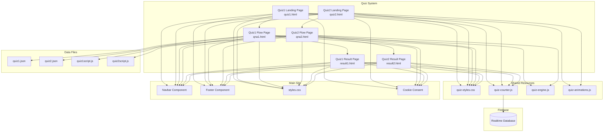

# Design Document: Quiz Integration

## Overview

This design document describes the technical implementation for integrating two quiz features ("운전성향 테스트" and "극한의 시나리오 챌린지") into the safedrive.kr website. The implementation involves creating a modular quiz system with shared components, Firebase-backed real-time statistics, and engaging animated hero sections.

The quiz system follows a three-page flow pattern:
1. **Landing Page** - Introduces the quiz with animated hero, statistics, and start button
2. **Quiz Flow Page** - Interactive question/answer interface with progress tracking
3. **Result Page** - Displays personality type result with sharing options

## Architecture



### File Structure

```
quiz/
├── quiz-styles.css          # Shared quiz styles
├── quiz-counter.js          # Firebase counter system
├── quiz-engine.js           # Shared quiz flow logic
├── quiz-animations.js       # Anime.js animation utilities
├── quiz1/
│   ├── quiz1.html           # Landing page (improved)
│   ├── quiz1.json           # Questions data (existing)
│   ├── quiz1script.js       # Result calculation (existing)
│   ├── qna1.html            # Quiz flow page (new)
│   └── result1.html         # Result page (new)
└── quiz2/
    ├── quiz2.html           # Landing page (improved)
    ├── quiz2.json           # Questions data (existing)
    ├── quiz2script.js       # Result calculation (existing)
    ├── qna2.html            # Quiz flow page (new)
    └── result2.html         # Result page (new)
```

## Components and Interfaces

### 1. Quiz Counter Module (quiz-counter.js)

Handles Firebase Realtime Database integration for tracking quiz statistics.

```javascript
/**
 * QuizCounter - Firebase-based real-time quiz statistics
 */
const QuizCounter = {
    /**
     * Initialize Firebase connection for a specific quiz
     * @param {string} quizId - 'quiz1' or 'quiz2'
     * @returns {Promise<void>}
     */
    init(quizId) {},
    
    /**
     * Get current statistics with real-time listener
     * @param {string} quizId - 'quiz1' or 'quiz2'
     * @param {function} callback - Called with stats object on updates
     * @returns {function} Unsubscribe function
     */
    subscribe(quizId, callback) {},
    
    /**
     * Increment total completion count
     * @param {string} quizId - 'quiz1' or 'quiz2'
     * @returns {Promise<void>}
     */
    incrementTotal(quizId) {},
    
    /**
     * Increment result type count
     * @param {string} quizId - 'quiz1' or 'quiz2'
     * @param {string} resultType - Result type code (e.g., 'SFE', 'A')
     * @returns {Promise<void>}
     */
    incrementResult(quizId, resultType) {},
    
    /**
     * Get the most popular result type
     * @param {string} quizId - 'quiz1' or 'quiz2'
     * @returns {Promise<{type: string, count: number}>}
     */
    getMostPopular(quizId) {}
};
```

### 2. Quiz Engine Module (quiz-engine.js)

Manages quiz flow, state, and navigation.

```javascript
/**
 * QuizEngine - Quiz flow management
 */
const QuizEngine = {
    /**
     * Initialize quiz with questions data
     * @param {Object} config - Quiz configuration
     * @param {Array} config.questions - Questions array from JSON
     * @param {function} config.calculateResult - Result calculation function
     * @param {string} config.resultPageUrl - URL to redirect after completion
     */
    init(config) {},
    
    /**
     * Get current question
     * @returns {Object} Current question object
     */
    getCurrentQuestion() {},
    
    /**
     * Get progress information
     * @returns {{current: number, total: number, percentage: number}}
     */
    getProgress() {},
    
    /**
     * Record answer and advance to next question
     * @param {string} answer - Selected answer value
     * @returns {boolean} True if quiz completed
     */
    submitAnswer(answer) {},
    
    /**
     * Go back to previous question
     * @returns {boolean} True if successful
     */
    goBack() {},
    
    /**
     * Reset quiz to beginning
     */
    restart() {},
    
    /**
     * Get all recorded answers
     * @returns {Array<string>}
     */
    getAnswers() {},
    
    /**
     * Calculate and return final result
     * @returns {string} Result type code
     */
    getResult() {}
};
```

### 3. Quiz Animations Module (quiz-animations.js)

Provides anime.js-based animations for hero sections.

```javascript
/**
 * QuizAnimations - SVG animation utilities using anime.js
 */
const QuizAnimations = {
    /**
     * Initialize Quiz1 hero animation (driving theme)
     * @param {HTMLElement} container - Container element for animation
     */
    initQuiz1Hero(container) {},
    
    /**
     * Initialize Quiz2 hero animation (emergency theme)
     * @param {HTMLElement} container - Container element for animation
     */
    initQuiz2Hero(container) {},
    
    /**
     * Pause all animations (for performance)
     */
    pause() {},
    
    /**
     * Resume animations
     */
    resume() {},
    
    /**
     * Cleanup animations on page unload
     */
    destroy() {}
};
```

### 4. Shared UI Components

#### Navbar Integration
All quiz pages include the main site navbar by copying the HTML structure:

```html
<nav class="navbar" id="mainNavbar">
    <div class="nav-container">
        <a href="/" class="nav-logo">
            
        </a>
        <ul class="nav-menu" id="navMenu">
            <li><a href="/" class="nav-link">홈</a></li>
            <li><a href="/#quiz-section" class="nav-link">퀴즈</a></li>
            <!-- ... other links ... -->
        </ul>
        <button class="nav-toggle" id="navToggle" aria-label="메뉴 열기">
            <span class="hamburger-line"></span>
            <span class="hamburger-line"></span>
            <span class="hamburger-line"></span>
        </button>
    </div>
</nav>
```

#### Footer Integration
```html
<footer class="site-footer">
    <div class="footer-content">
        <nav class="footer-links">
            <a href="/terms.html">이용약관</a> | 
            <a href="/privacy.html">개인정보처리방침</a> | 
            <a href="/legal.html">법적 고지</a> | 
            <a href="/faq.html">자주 묻는 질문</a>
        </nav>
        <a class="footer-contact-link" href="/contact.html">문의</a>
        <p class="copyright">© 2025 Hustle Up. All rights reserved.</p>
    </div>
</footer>
```

## Data Models

### Firebase Realtime Database Structure

```json
{
  "quizStats": {
    "quiz1": {
      "totalCompletions": 12403,
      "results": {
        "SFE": 1520,
        "SFI": 1890,
        "SME": 2100,
        "SMI": 1650,
        "CFE": 1200,
        "CFI": 1800,
        "CME": 1243,
        "CMI": 1000
      }
    },
    "quiz2": {
      "totalCompletions": 8201,
      "results": {
        "A": 1500,
        "B": 2100,
        "C": 1800,
        "D": 900,
        "AB": 800,
        "BC": 600,
        "AC": 301,
        "DA": 200
      }
    }
  }
}
```

### Quiz State Model (Client-side)

```typescript
interface QuizState {
    quizId: string;           // 'quiz1' or 'quiz2'
    currentIndex: number;     // Current question index (0-based)
    answers: string[];        // Array of answer values
    startTime: number;        // Timestamp when quiz started
    isComplete: boolean;      // Whether quiz is finished
}

interface QuizQuestion {
    id: number;
    q: string;                // Question text
    axis?: string;            // For Quiz1: 'speed', 'rule', 'emotion'
    options: QuizOption[];
}

interface QuizOption {
    text: string;             // Option display text
    val: string;              // Option value for calculation
}

interface QuizResult {
    type: string;             // Result type code
    title: string;            // Result title
    desc: string;             // Result description
}
```

### URL Parameters for Result Sharing

Result pages accept URL parameters for direct linking:
- `?type=SFE` - Pre-populate result type for shared links
- Used for generating proper Open Graph previews

## Hero Animation Designs

### Quiz1 Hero Animation (운전성향 테스트)

**Theme:** Calm driving journey with personality indicators

**SVG Elements:**
1. **Road Scene** - Infinite scrolling road with lane markings
2. **Car** - Stylized car that subtly bounces/sways
3. **Dashboard** - Speedometer needle that oscillates
4. **Personality Icons** - Four floating icons representing result types (rotating/pulsing)
5. **Background** - Gradient sky with moving clouds

**Animation Sequence:**
```javascript
// Road lines moving downward (infinite loop)
anime({
    targets: '.road-line',
    translateY: ['-100%', '100%'],
    duration: 2000,
    loop: true,
    easing: 'linear'
});

// Car gentle bounce
anime({
    targets: '.hero-car',
    translateY: [-5, 5],
    duration: 1500,
    direction: 'alternate',
    loop: true,
    easing: 'easeInOutSine'
});

// Speedometer needle oscillation
anime({
    targets: '.speedometer-needle',
    rotate: [-30, 30],
    duration: 3000,
    direction: 'alternate',
    loop: true,
    easing: 'easeInOutQuad'
});

// Personality icons floating
anime({
    targets: '.personality-icon',
    translateY: [-10, 10],
    opacity: [0.7, 1],
    delay: anime.stagger(200),
    duration: 2000,
    direction: 'alternate',
    loop: true,
    easing: 'easeInOutSine'
});
```

### Quiz2 Hero Animation (극한의 시나리오 챌린지)

**Theme:** Dramatic emergency scenario with tension

**SVG Elements:**
1. **Warning Triangle** - Pulsing hazard sign
2. **Flashing Lights** - Emergency vehicle lights effect
3. **Road with Obstacles** - Dramatic perspective road
4. **Danger Icons** - Rotating warning symbols
5. **Background** - Dark gradient with red accents

**Animation Sequence:**
```javascript
// Warning triangle pulse
anime({
    targets: '.warning-triangle',
    scale: [1, 1.1],
    opacity: [0.8, 1],
    duration: 800,
    direction: 'alternate',
    loop: true,
    easing: 'easeInOutQuad'
});

// Emergency lights flash
anime({
    targets: '.emergency-light-left',
    opacity: [0, 1],
    duration: 500,
    direction: 'alternate',
    loop: true,
    easing: 'steps(1)'
});

anime({
    targets: '.emergency-light-right',
    opacity: [1, 0],
    duration: 500,
    direction: 'alternate',
    loop: true,
    easing: 'steps(1)'
});

// Danger icons rotation
anime({
    targets: '.danger-icon',
    rotate: 360,
    duration: 4000,
    loop: true,
    easing: 'linear'
});

// Background pulse (subtle)
anime({
    targets: '.hero-background',
    backgroundColor: ['#1e272e', '#2d1f1f'],
    duration: 2000,
    direction: 'alternate',
    loop: true,
    easing: 'easeInOutSine'
});
```

## Error Handling

### Firebase Connection Errors
- Display cached/default statistics if Firebase is unavailable
- Show "오프라인" indicator when disconnected
- Queue counter increments for retry when connection restored

### Quiz Flow Errors
- Validate JSON data on load, show error message if malformed
- Handle missing questions gracefully with fallback
- Preserve quiz state in sessionStorage for page refresh recovery

### Result Calculation Errors
- Validate answer array length before calculation
- Default to most common result type if calculation fails
- Log errors for debugging without exposing to users

## Testing Strategy

### Unit Testing
- Test QuizCounter Firebase operations with mock
- Test QuizEngine state management
- Test result calculation functions (existing quiz1script.js, quiz2script.js)

### Integration Testing
- Test full quiz flow from landing to result
- Test Firebase real-time updates
- Test URL parameter handling for shared results

### Accessibility Testing
- Keyboard navigation through all quiz pages
- Screen reader compatibility
- Color contrast verification

### Cross-browser Testing
- Chrome, Firefox, Safari, Edge
- Mobile browsers (iOS Safari, Chrome Android)
- Animation performance on low-end devices


## Correctness Properties

*A property is a characteristic or behavior that should hold true across all valid executions of a system—essentially, a formal statement about what the system should do. Properties serve as the bridge between human-readable specifications and machine-verifiable correctness guarantees.*

### Property 1: ARIA Labels for Interactive Elements

*For any* interactive element (button, link, input) in the Quiz_System, that element SHALL have an aria-label attribute or accessible name.

**Validates: Requirements 1.4, 4.7**

### Property 2: Counter Increment Consistency

*For any* quiz completion event, the Quiz_Counter_System SHALL increment the total count by exactly 1, and *for any* result type received, the specific result type count SHALL increment by exactly 1.

**Validates: Requirements 3.4, 3.5, 5.9**

### Property 3: Real-time Display Synchronization

*For any* update to the Firebase quiz statistics, the displayed counter value on the Landing_Page SHALL match the database value within the real-time listener callback.

**Validates: Requirements 3.3**

### Property 4: Progress Indicator Accuracy

*For any* question index n (0-based) in a quiz with total T questions, the progress indicator SHALL display (n+1)/T as the current progress.

**Validates: Requirements 4.2**

### Property 5: Answer Recording and Advancement

*For any* answer selection on question n, the answers array length SHALL increase by 1 AND the current question index SHALL advance to n+1 (or trigger completion if n+1 equals total questions).

**Validates: Requirements 4.3**

### Property 6: Back Navigation State

*For any* question index n > 0, clicking the back button SHALL decrease the current question index to n-1 AND preserve all previously recorded answers.

**Validates: Requirements 4.5**

### Property 7: Restart State Reset

*For any* quiz state (regardless of current progress), clicking the restart button SHALL reset the current index to 0 AND clear all recorded answers.

**Validates: Requirements 4.6**

### Property 8: Result Display Accuracy

*For any* valid result type code, the Result_Page SHALL display the title and description that exactly match the corresponding entry in the quiz JSON data file.

**Validates: Requirements 5.1**

### Property 9: Dynamic Meta Tags

*For any* result type displayed on the Result_Page, the Open Graph and Twitter meta tags SHALL contain the result type's title in their content.

**Validates: Requirements 5.5**

### Property 10: Share URL Parameters

*For any* share action triggered from the Result_Page, the generated URL SHALL include a query parameter containing the result type code.

**Validates: Requirements 5.8**

### Property 11: Color Contrast Compliance

*For any* text element in the Quiz_System, the contrast ratio between text color and background color SHALL be at least 4.5:1 for normal text and 3:1 for large text.

**Validates: Requirements 8.1**

### Property 12: Keyboard Navigation

*For any* interactive element in the Quiz_System, that element SHALL be reachable via Tab key navigation AND activatable via Enter or Space key.

**Validates: Requirements 8.2**

### Property 13: Focus Indicators

*For any* focusable element in the Quiz_System, when focused, that element SHALL display a visible focus indicator (outline or equivalent visual change).

**Validates: Requirements 8.3**

### Property 14: Heading Hierarchy

*For any* page in the Quiz_System, heading elements SHALL follow proper hierarchy without skipping levels (e.g., h1 followed by h2, not h1 followed by h3).

**Validates: Requirements 8.4**

### Property 15: Image Alt Text

*For any* img element in the Quiz_System, that element SHALL have a non-empty alt attribute providing meaningful description.

**Validates: Requirements 8.5**

### Property 16: Unique Page Metadata

*For any* two distinct pages in the Quiz_System, the title element content AND meta description content SHALL be different.

**Validates: Requirements 9.1**
